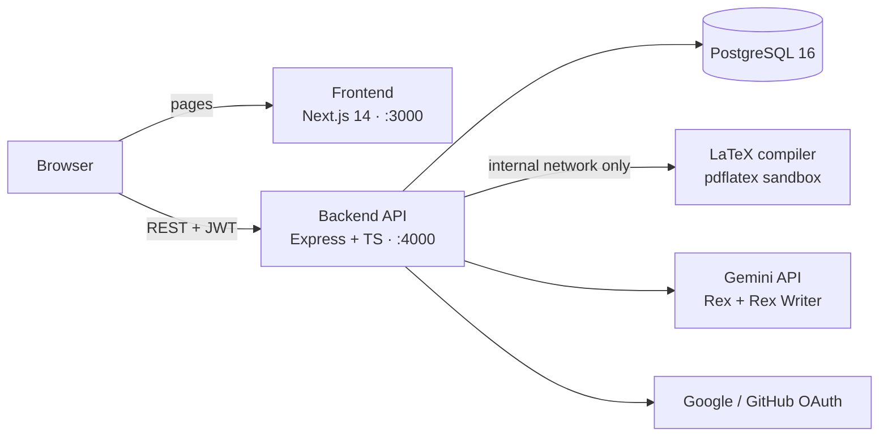

# ResumeX

**AI-assisted LaTeX resume builder.** Chat with **Rex**, an AI interviewer, and get an ATS-optimized, typeset PDF resume in minutes, then fine-tune every line in a live LaTeX editor.


## Features

- **Rex, the AI interviewer.** It asks friendly, one-at-a-time questions about your target role, experience and projects, and only for the sections your chosen template uses.
- **Rex Writer.** One pass at build time rewrites your answers into impact-first bullets, a summary and ATS keywords. Code guardrails keep every fact and number traceable to what you said.
- **Job tailoring.** Paste a job description and Rex Writer mirrors its keywords where your experience backs them up.
- **11 LaTeX templates** for tech, data, business, students, career changers and executives, each with an estimated ATS score and a real compiled preview.
- **Two-panel editor.** LaTeX source on the left, compiled PDF on the right; compile, save and download.
- **Persistent chat.** The Rex conversation is saved with each resume, so you can come back, add details and regenerate.
- **Sign-in** with email/password, Google or GitHub.
- **Sandboxed compilation.** `pdflatex` runs in an isolated container with no network, no shell escape and strict time and memory limits.

## Architecture



All services run under one `docker-compose.yml`. The compiler sits on an `internal: true` network that only the backend can reach.

## Tech stack

| Layer | Technology |
| --- | --- |
| Frontend | Next.js 14 (App Router), React 18, TypeScript, Tailwind CSS, Framer Motion |
| Backend | Node.js 20, Express 4, TypeScript, `pg` (raw SQL), JWT, bcrypt, helmet |
| Database | PostgreSQL 16 (JSONB for resume content) |
| PDF engine | TeX Live `pdflatex` in a small Express microservice |
| AI | Google Gemini (`gemini-3.5-flash-lite`) via REST with structured JSON output |
| Infrastructure | Docker Compose |

## Quick start

**Prerequisites:** Docker Desktop (or Docker Engine with Compose v2). Nothing else needs installing on your machine.

```bash
git clone <repo-url> resumex && cd resumex
cp .env.example .env          # then edit values; see "Configuration"
docker compose up -d --build  # first build downloads TeX Live (a few minutes)
```

| Service | URL |
| --- | --- |
| App | http://localhost:3000 |
| API | http://localhost:4000/api (health check: http://localhost:4000/health) |
| Adminer (DB browser) | http://localhost:8081 (System: PostgreSQL, server `db`) |

Database migrations run automatically when the backend starts. The app works without any API keys: the AI interviewer and social sign-in turn on when their keys are set, and users fall back to a plain form until then.

## Configuration

Set these in the root `.env` (full reference in [`ENV_CONFIG.md`](ENV_CONFIG.md)):

| Variable | Purpose |
| --- | --- |
| `POSTGRES_*` | Database name, user and password (any values for local development) |
| `JWT_SECRET` | Token signing secret: `openssl rand -base64 32` |
| `GEMINI_API_KEY` | Enables Rex; get one at [Google AI Studio](https://aistudio.google.com/apikey) |
| `GEMINI_MODEL`, `GEMINI_WRITER_MODEL` | Optional model overrides (defaults to `gemini-3.5-flash-lite`) |
| `GITHUB_CLIENT_ID/SECRET` | GitHub OAuth App, callback `http://localhost:4000/api/auth/github/callback` |
| `GOOGLE_CLIENT_ID/SECRET` | Google OAuth client, redirect `http://localhost:4000/api/auth/google/callback` |

The backend reads `.env` only when its container is created, so run `docker compose up -d backend` after changing it.

## Project structure

```
.
├── docker-compose.yml        # frontend, backend, db, latex-compiler, adminer
├── .env.example              # every variable, with defaults
├── ResumeX/                  # Next.js frontend
│   ├── src/app/              # routes: marketing pages, auth, dashboard, create, editor, profile
│   ├── src/components/       # ResumeInterview (Rex chat), TemplateGallery, ProfileMenu, ...
│   ├── src/sections/         # landing page sections (Hero, MeetRex, Features, ...)
│   ├── src/lib/              # api client, template metadata, Rex Writer helper
│   ├── src/context/          # AuthContext
│   └── public/templates/     # template preview PNG/PDF files
├── backend/                  # Express + TypeScript API
│   ├── src/routes → controllers → services → models
│   ├── src/services/         # auth, oauth, resume, template engine, compile, ai, resume-writer
│   ├── src/scripts/          # migrate, render-previews
│   ├── migrations/           # numbered SQL, applied on startup
│   └── templates/            # the 11 .tex templates with {{PLACEHOLDERS}}
└── latex-compiler/           # sandboxed pdflatex microservice
```

## How the AI works

1. **Interview** (`POST /api/ai/interview`): the client sends the whole chat and the data collected so far; Gemini returns `{ reply, form_data, done }` against a strict JSON schema built from the template's sections. The server merges each turn so earlier answers are never lost.
2. **Polish** (`POST /api/ai/polish`): on Build or Update, Rex Writer rewrites the raw answers for ATS. `lockFacts` then restores factual fields (names, titles, companies, dates, education). It also discards any rewrite containing a number the candidate never gave, and keeps only skills the candidate mentioned.
3. **Typeset**: the template engine escapes the data into the `.tex` placeholders and the compiler produces the PDF.

The raw answers are stored in `resumes.interview` and the polished content in `resumes.form_data`, so each update re-polishes from the original facts.

## API

All routes are under `/api`. Responses use `{ success, data }` or `{ success: false, error }`.

| Area | Endpoints |
| --- | --- |
| Auth | `POST /auth/signup`, `POST /auth/login`, `GET /auth/me`, `GET /auth/{github,google}` (+ `/callback`) |
| Users | `PATCH /users/me/profile` |
| Templates | `GET /templates` (`?all=true` includes Pro), `GET /templates/:id` |
| Resumes | `GET/POST /resumes`, `GET/PATCH/DELETE /resumes/:id`, `POST /resumes/:id/fork`, `POST /resumes/:id/compile` |
| AI | `GET /ai/status`, `POST /ai/interview`, `POST /ai/polish` |

See [`api_schema.md`](api_schema.md) for request and response details and [`db_schema.md`](db_schema.md) for tables.

## Common tasks

**Add a template**

1. Create `backend/templates/<slug>.tex`. Define `\resumeSubheading`, `\resumeItem` and the list macros, and use placeholders such as `{{NAME}}`, `{{CONTACT}}`, `{{SUMMARY}}`, `{{EXPERIENCE}}` and `{{SKILLS}}`. Each list placeholder must sit inside its own `\section` and list (copy an existing template).
2. Add a migration that inserts the template row (`name`, `tex_path`, `tags`, `is_pro_only`, `ats_score`).
3. Regenerate the gallery previews:
   ```bash
   docker compose exec backend npm run render-previews
   # then convert backend/template-previews/<slug>.pdf to ResumeX/public/templates/<slug>.png
   # (macOS: sips -s format png -Z 1400 <pdf> --out <png>) and copy the PDF alongside
   ```

**Change the database:** add the next `backend/migrations/00N_*.sql` file. Never edit an applied migration.

**Inspect logs:** `docker compose logs -f backend` (Gemini errors and Rex Writer guardrail rejections are logged here).

## Development notes

- Dependencies live in `/node_modules` inside each image, not in the bind-mounted source folder. Don't run `npm install` on the host inside `ResumeX/` or `backend/`. After changing a `package.json`, rebuild with `docker compose up -d --build <service>`.
- Type-check: `docker compose exec backend tsc --noEmit` and `docker compose exec frontend tsc --noEmit`.
- Production build check: `docker compose run --rm --no-deps frontend next build`.

## Roadmap

- Token expiry and rate limits on the AI and compile endpoints
- Stripe billing for the Pro plan
- CodeMirror editor with LaTeX highlighting and inline compile errors
- Automated tests for the template engine and Rex Writer guardrails
- Production deployment (managed Postgres, HTTPS, secrets management)
