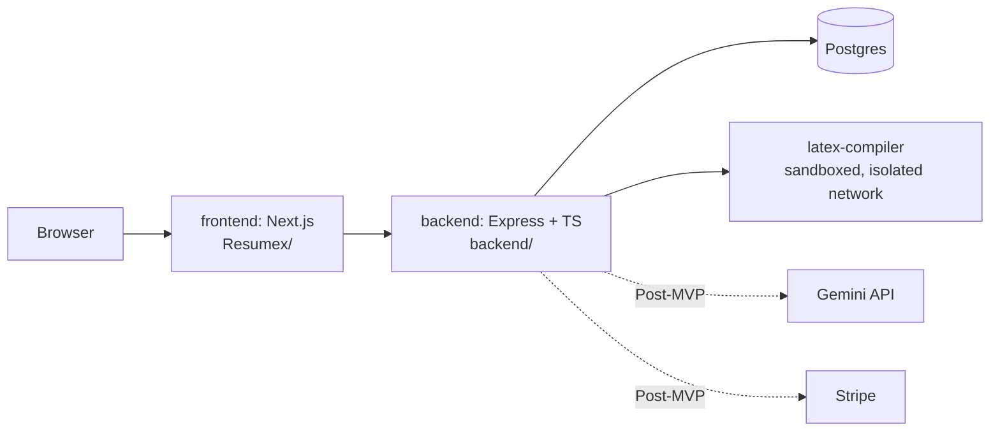

# ARCHITECTURE.md — ResumeX System Architecture (Dev / Docker Phase)

## 1. Service Overview

All five pieces (frontend, backend, db, latex-compiler, and later adminer)
run as separate containers under one `docker-compose.yml` at the repo root.

## 2. Service Responsibilities

| Service | Responsibility | Talks to |
|---|---|---|
| `frontend` | Existing Next.js UI. Renders forms, editor, dashboard. | `backend` (REST) |
| `backend` | Auth, form data persistence, template population, orchestrates compile requests, (later) AI + Stripe calls | `db`, `latex-compiler` |
| `db` | Postgres — users, profiles, resumes, templates | — |
| `latex-compiler` | Accepts a `.tex` string, runs `pdflatex` in a locked-down sandbox, returns PDF bytes | Only reachable from `backend`, no outbound internet |
| `adminer` (dev convenience only) | Web UI to inspect Postgres during development | `db` |

## 3. LaTeX Compile Sandbox — Security Requirements
This is the highest-risk part of the system since it executes on user-influenced input.
- Runs in its **own Docker network with `internal: true`** — no route to the public internet.
- Non-root user inside the container.
- `--no-shell-escape` passed to `pdflatex` (never allow shell-escape).
- Hard timeout (~10s) on the compile process; kill and return an error past that.
- Memory (`mem_limit`) and CPU (`cpus`) limits set at the container/compose level.
- Read-only filesystem except a `tmpfs` scratch directory for the compile job.
- Only `backend` can reach this service — it is never exposed directly to the frontend or the internet.

## 4. Request Flow: Compile
1. Frontend sends edited LaTeX source to `POST /api/resumes/:id/compile` on `backend`.
2. `backend` validates the request belongs to the authenticated user.
3. `backend` forwards the `.tex` string to `latex-compiler` over the internal network.
4. `latex-compiler` writes it to a scratch dir, runs `pdflatex` with limits, returns PDF or a structured error (compiler log).
5. `backend` streams the PDF back to `frontend`, which updates the preview pane.

## 5. Deployment Note
This architecture is for **local Docker development only**. Production
targets (Cloud Run / ECS / Fargate / Vercel per the original project plan)
are intentionally out of scope until the Docker-based MVP is validated.